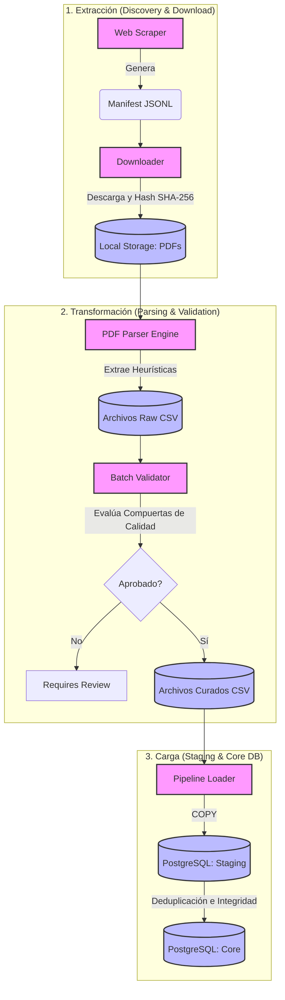

# Natación Chile - Data Platform

Plataforma de datos y pipeline ETL (Extract, Transform, Load) diseñada para ingerir, normalizar y consolidar resultados históricos de competencias de natación en Chile. El foco inicial de esta plataforma son los resultados de natación master publicados por la Federación Chilena de Deportes Acuáticos (FECHIDA) y la Fundación Chilena Master de Natación (FCHMN).

## 📌 Valor del Negocio

Históricamente, los resultados de competencias de natación en Chile se distribuyen en formato PDF (frecuentemente generados por software como HY-TEK o Swim It Up), lo que imposibilita el seguimiento longitudinal del rendimiento de los atletas, el análisis estadístico y la correcta validación de récords. 

Este proyecto resuelve ese problema mediante la creación de una **fuente única de verdad (Single Source of Truth)**. Extrae datos estructurados desde archivos PDF opacos, aplica reglas de negocio para curar identidades deportivas y expone los datos en una base de datos relacional lista para integraciones analíticas o interfaces de usuario.

## 🏗️ Arquitectura de Datos

El sistema implementa una arquitectura ELT/ETL robusta con separación estricta de responsabilidades, asegurando trazabilidad, idempotencia y calidad de datos.



### Decisiones de Diseño Clave

1. **Staging antes de Core:** Los datos ingresan primero a tablas `stg_*` en PostgreSQL para casteos y cruces antes de insertarse en el modelo dimensional final.
2. **Desacoplamiento de Identidad:** La entidad `club` se usa para contexto, pero la identidad del `athlete` no está rígidamente atada a un club de por vida, permitiendo el rastreo longitudinal.
3. **Idempotencia y Trazabilidad:** Cada carga verifica el `pdf_sha256` y los orígenes (`source_url`). Reprocesar el mismo documento no duplica métricas, y un error en un documento no contamina el resto del lote (aislamiento de fallos).
4. **Validación Pre-Carga (Compuertas):** Antes de tocar la base de datos de producción, el sistema ejecuta validaciones estrictas (tiempos imposibles, residuos de OCR, campos nulos). Si el lote falla, se marca como `requires_review` y no se ingesta.

## 🚀 Tecnologías

- **Lenguaje Principal:** Python 3
- **Base de Datos:** PostgreSQL
- **Procesamiento de PDF:** Expresiones regulares avanzadas y heurísticas de posicionamiento espacial para interpretar formatos multicollumna (HY-TEK, Swim It Up).
- **Orquestación:** Scripts modulares CLI con pipelines idempotentes.

## ⚙️ Estructura del Proyecto

- `scripts/parse_results_pdf.py`: Motor de parsing. Convierte PDFs en CSVs operativos.
- `scripts/run_results_batch.py`: Ejecuta validaciones estrictas sobre los CSVs parseados.
- `scripts/scrape_fchmn.py` & `download_manifest_pdfs.py`: Scraper y descargador asíncrono seguro basado en manifiestos.
- `scripts/run_pipeline_results.py`: Orquestador de carga desde CSVs hacia staging y core en PostgreSQL.
- `scripts/curate_athlete_names.py`: Motor de consolidación de identidad (resolución determinística de residuos OCR y alias de nadadores).
- `sql/schema.sql`: DDL de la base de datos (Core, Staging, Restricciones).

## 🛠️ Quickstart (Uso Operativo)

Para instalar las dependencias:
```powershell
python -m pip install -r backend\requirements.txt
```

### Flujo Típico de Ingestión Segura

1. **Descubrir URLs (Discovery)**
   Genera un manifest (`.jsonl`) sin descargar nada.
   ```powershell
   python backend\scripts\scrape_fchmn.py --url https://fchmn.cl/resultados/ --manifest backend\data\raw\manifests\fchmn_2026.jsonl --pdf-dir backend\data\raw\results_pdf\fchmn --out-dir-root backend\data\raw\results_csv\fchmn
   ```

2. **Descargar PDFs (Download)**
   Descarga de manera controlada y calcula el hash criptográfico para trazabilidad.
   ```powershell
   python backend\scripts\download_manifest_pdfs.py --manifest backend\data\raw\manifests\fchmn_2026.jsonl --summary-json backend\data\raw\batch_summaries\download_summary.json
   ```

3. **Parsear y Validar (Pre-Load)**
   Transforma PDFs a CSVs y pasa las reglas de calidad **sin cargar a la BD**.
   ```powershell
   python backend\scripts\run_results_batch.py --manifest backend\data\raw\manifests\fchmn_2026.jsonl --summary-json backend\data\raw\batch_summaries\batch_summary.json
   ```

4. **Congelar y Cargar (Load)**
   Congela un manifest excluyendo archivos con errores, luego ejecuta la ingesta en PostgreSQL.
   ```powershell
   # Congelar
   python backend\scripts\freeze_validated_manifest.py --batch-summary backend\data\raw\batch_summaries\batch_summary.json --manifest backend\data\raw\manifests\frozen.jsonl --competition-scope fchmn_local
   
   # Cargar a Core
   python backend\scripts\run_results_batch.py --manifest backend\data\raw\manifests\frozen.jsonl --load --user postgres --password ******* 
   ```

## 📖 Documentación Adicional
Revisa el directorio `docs/` para esquemas de base de datos (`schema.md`), contratos del parser (`parser_contracts.md`) y el proceso de validación pre-carga (`pre_load_checklist.md`).
